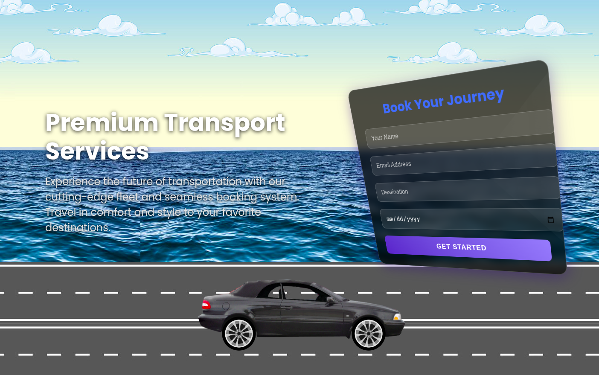

# Premium Transport Services - 3D Booking Lnading Page

 *Replace with your actual screenshot*

A modern, interactive booking website Lnading Page featuring 3D animated elements and glass-morphism design effects. This project combines captivating animations with practical booking functionality.

## Features

- **Immersive 3D Background**
  - Animated sky, buildings, and road
  - Realistic truck with rotating wheels
  - Smooth parallax scrolling effects

- **Interactive Booking Form**
  - Glass-morphism design with dynamic lighting
  - 3D tilt effects on mouse movement
  - Floating animation for visual interest

- **Responsive Design**
  - Adapts to all screen sizes
  - Mobile-friendly layout
  - Performance optimized animations

## Technologies Used

- **Frontend**
  - HTML5, CSS3 (with animations)
  - JavaScript (for interactive elements)
  - Three.js (for 3D elements)

- **Design**
  - Glass-morphism UI components
  - Dark theme for better readability
  - Custom animations and transitions

## Installation

1. Clone the repository:
   ```bash
   git clone https://github.com/bonnymkuu/Transport-Services-Landing-Page.git